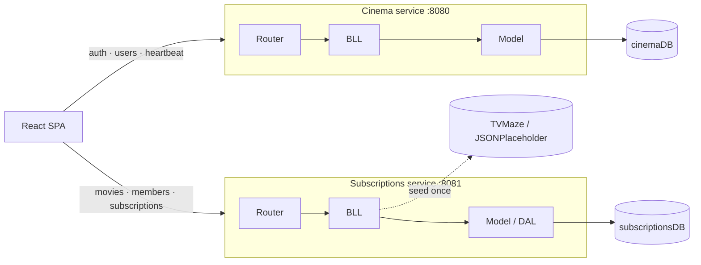

# FullStack Movies & Subscriptions

A cinema back-office and movie-subscription system built as **two independent Express services** (separate ports, separate MongoDB databases) behind one React SPA — with a custom JWT scheme that ties token lifetime to a per-user daily session budget instead of a fixed expiry.

**[Live code →](https://github.com/ShYulia/FullStack-Movies-Subscriptions)** · Node.js · Express · MongoDB · React · Vite

---

## Engineering highlights

- **Service boundaries, not just folders.** `cinema` (auth/users, `:8080`) and `subscriptions` (movies/members, `:8081`) are two separate Express apps with independent Mongo connections — an actual seam a real system could split into separate deployables, not a monolith with a `/v2` prefix.
- **Layered backend on both services.** Every route follows `Router → BLL (business logic) → Model/DAL`, keeping HTTP, domain logic, and persistence independently testable and replaceable.
- **Non-trivial auth model.** JWTs aren't just "valid for 1h" — `expiresIn` is computed per-login from a remaining-minutes budget tracked server-side (`server/data/userSessions.json`); a client heartbeat every 60s keeps it honest, and the client independently decodes+checks token expiry before every request (`useAxios.js`) as a second line of defense.
- **Idempotent external data seeding.** On boot, the subscriptions service pulls a movie catalog (TVMaze) and member list (JSONPlaceholder) and guards the fetch with a `Status` flag so restarts don't duplicate data — then wipes it on graceful shutdown (`SIGINT`/`SIGTERM`) so every run starts from a known state.

## Architecture



## Stack

`Node.js` `Express 4` `MongoDB / Mongoose 8` `JWT` · `React 18` `React Router 6` `Vite 5` `Tailwind CSS` `Axios`

## Run it

```bash
# server (MongoDB running on localhost:27017)
cd server && npm install && npm start   # :8080 + :8081

# client
cd client && npm install && npm run dev
```

## Known tradeoffs (by design, for a demo scope)

- Passwords compared in plaintext, not hashed — would move to `bcrypt` for production.
- Session/permission state lives in flat JSON files, not the DB — fine single-instance, not horizontally scalable.
- No automated test suite yet.

---
**Yulia Sh.** — [github.com/ShYulia](https://github.com/ShYulia)
